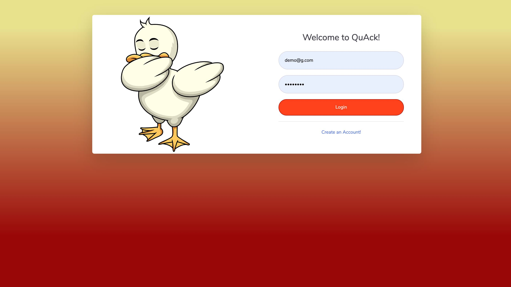

# QuAck (Stevens school social network application)

This repo is for organizing collaborative effort from the teammates for SSW 690 project course at Stevens Institute of Technology.

# Quick Look

# setting up for simple RESTful API test

1. do a pull on the master branch
2. 'cd' into 'rest' folder

in your shell command line, enter:

3. 'python3 manage.py migrate'
4. 'python3 manage.py runserver'

5. go to 'localhost:8000' on your broswer to make sure the server is running
6. make a GET API call by using
   'http://127.0.0.1:8000/snippets/' or
   'http://127.0.0.1:8000/snippets/1/'

7. try to parse the response (in JSON format) on iOS/Android/webpage.
