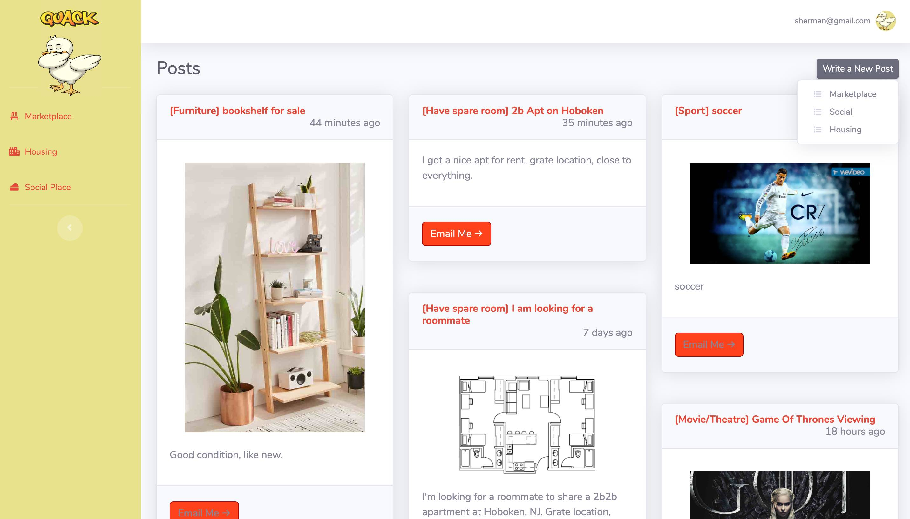

# QuAck

This repo is for organizing collaborative effort from the teammates for SSW 690 project course at Stevens Institute of Technology.

# Overview

QuAck is a Stevens school social network application. The project is five-person team collaboration effort with multi-platform client app (web, iOS and Android). The back end is supported by Google's Firebase platform. We utilize authentication and data storage APIs in order to focus on feature development, given most of the team members have no previous technical background.

The result and final demo product is polished and satisfactory. Well done, team!

# Quick Look

### (Web) Login Screen

### (Web) Main Dashboard

## Instruction to Run with Firebase

(required) npm package manageer and Firebase commandline tools (npm i firebase-tools)

1. Download the repo and 'cd' into 'web_firebase' folder.

In your shell command line, enter:

2. 'firebase login' to login with your Google account.
3. 'firebase serve' to run service locally.
4. Go to 'localhost:5000' on your broswer to make sure the server is running.
